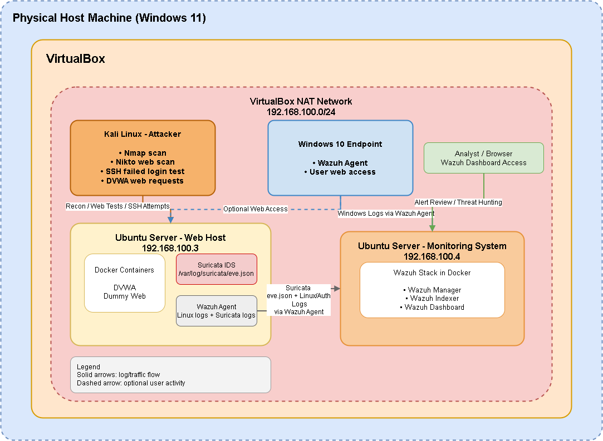

# V2 - IDS and Web Attack Monitoring

## Overview

This section documents the second version of the SOC homelab. V2 expands the original Wazuh endpoint monitoring setup by adding a dedicated Linux web host, Suricata IDS, DVWA, and controlled attack/testing scenarios.

The goal of V2 is to simulate a more realistic monitoring environment where a central Wazuh server collects security events from multiple systems, including endpoint logs and network-based IDS alerts.

## Objectives

- Deploy a separate Linux web host for vulnerable web application testing
- Integrate Suricata IDS with Wazuh for network-based alert visibility
- Host DVWA in Docker as a controlled vulnerable web application
- Simulate reconnaissance, web scanning, and authentication-based attack scenarios
- Analyze alerts and logs from Wazuh, Suricata, and Linux authentication events
- Document detection results, limitations, and future improvements

## Lab Architecture

<p align="center">
  
</p>

## Components

| Component | Role |
|---|---|
| Ubuntu Server LTS - Monitoring System | Runs Wazuh manager, indexer, and dashboard using Docker |
| Ubuntu Server LTS - Web Host | Hosts DVWA and dummy web services using Docker |
| Suricata IDS | Monitors network traffic on the web host and generates IDS alerts |
| Wazuh Agent | Installed on the web host to forward Suricata and system logs to Wazuh |
| Kali Linux | Attacker/testing machine used for controlled scans and tests |
| Windows 10 Endpoint | Additional monitored endpoint for user activity and endpoint visibility |

## Network Design

The lab uses a VirtualBox NAT Network to simulate a small internal subnet. This allows the virtual machines to communicate with each other while keeping the lab environment separated from the physical home network.

A host-only adapter may also be used for host-to-VM management access, such as accessing the Wazuh dashboard or using SSH.

## Log and Alert Flow

```text
Kali Linux
   |
   |  Scans / web requests / SSH login attempts
   v
Ubuntu Web Host
   |
   |  Suricata generates eve.json alerts
   |  Linux system generates authentication logs
   v
Wazuh Agent
   |
   |  Forwards logs and alerts
   v
Wazuh Monitoring Server
   |
   v
Wazuh Dashboard
